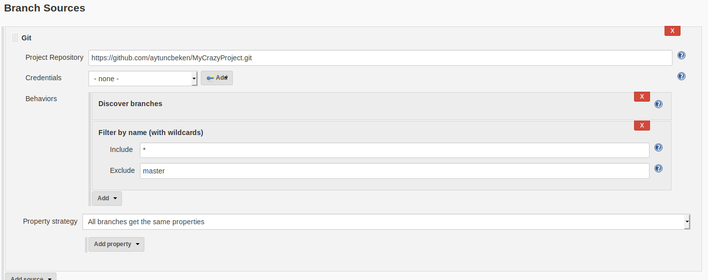
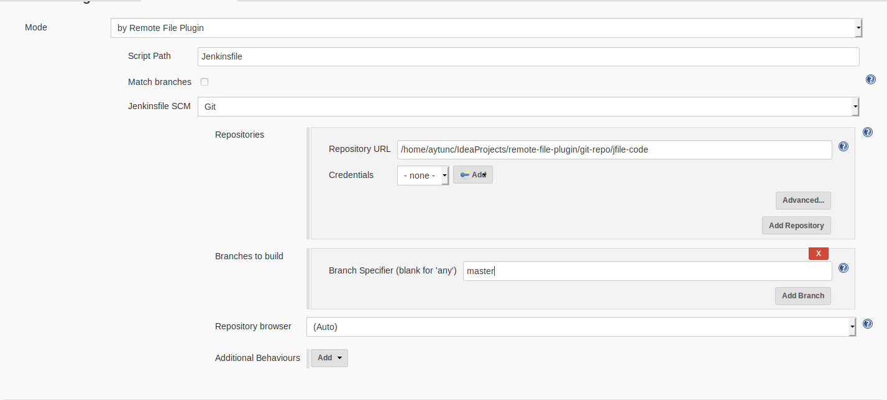
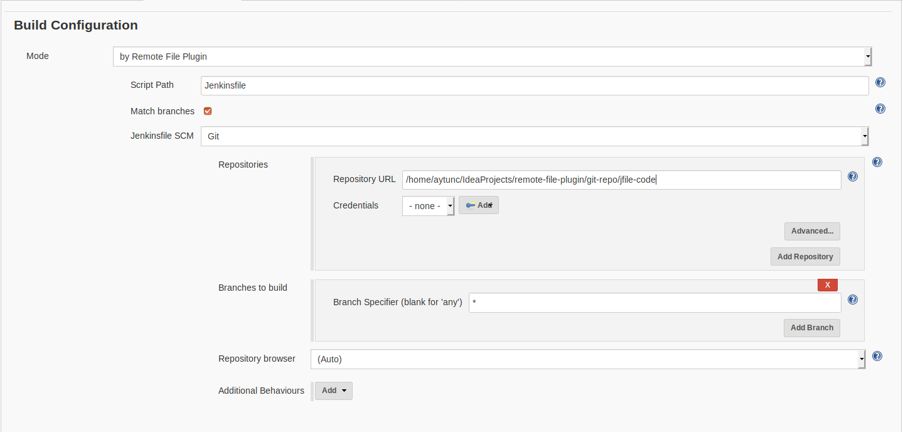
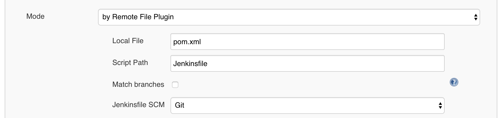
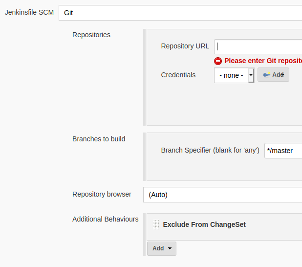
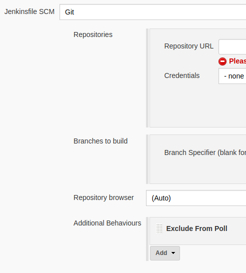

Remote Jenkinsfile Provider Plugin 
==========================
---------------------------------------
**Important:** Plugin name had changed to "Remote Jenkinsfile Provider Plugin". 
The previous name was "Remote File Plugin".
---------------------------------------

This plugin enables definition of external Jenkinsfile from another repository for MultiBranch Pipelines.

# Description
Jenkins MultiBranch Pipeline feature is great to manage multi branched repositories which need to have
dynamically created Pipeline Jobs on-demand. To use this feature you need to define [Jenkins Pipeline Script](https://github.com/jenkinsci/workflow-plugin/blob/master/TUTORIAL.md#understanding-flow-scripts)
in the repository alongside with the source code. 

However, when it comes to adding new definitions/stages/steps or maintaining
the Jenkins Pipeline Script for other reasons, you need to make all the changes within all branches or make changes in master branch 
and wait for other branches getting the update. 
For eliminating this you can use [Jenkins Shared Library](https://jenkins.io/doc/book/pipeline/shared-libraries/).
However, when you are in a large-scaled/enterprise environments with hundreds/thousands of developers with lots of repositories,
you need to somehow protect the content/stability of the Jenkins Pipeline Scripts to avoid failures. 

In this point Remote Jenkinsfile Provider Plugin comes in. With this plugin you can define/set Jenkins files from another
repository while still able to use MultiBranch Pipeline Project features. This way you will be able to centralize all Jenkins files 
in another repository where you can review or restrict changes and use MultiBranch Pipeline for multi branched repositories.

In summary, Using MultiBranch Pipeline Jobs with Remote Jenkinsfile Provider Plugin you can;

- Centralize Jenkins Files in another repository
- Easily maintain
- Review or restrict changes
- Apply changes to all Pipelines in seconds

# Environment Variables
Remote Jenkinsfile Provider plugin injects two environment variables into every build automatically.
These variables are described below,

-   RJPP_SCM_URL: URl of the repository as String which is defined in Remote Jenkinsfile Provider. 
    Comma separated if there are more than one URL definition.
-   RJPP_JENKINSFILE: Script Path of the Jenkinsfile as defined in Remote Jenkinsfile Provider.
-   RJPP_BRANCH: Branch name of the Jenkinsfile where it is cloned

These variables can be retrieved same as other environment variables in Jenkins.
```groovy
echo "${env.RJPP_SCM_URL}"
echo "${env.RJPP_JENKINSFILE}"
echo "${env.RJPP_BRANCH}"
```

**This feature only works for Git SCM definitions**

# Configuration

To use this Plugin first you need to install it from Jenkins Plugin Site, for details see Managing Plugins

After installing plugin for using the plugin you can follow the steps with examples below,

Assume that you have a project to build, named "MyCrazyProject", which is stored in a repository https://github.com/aytuncbeken/MyCrazyProject.git

- Create a new repository for storing Jenkins files for your projects. For example, it is named "MyJenkinsLibrary" and stored in https://github.com/aytuncbeken/MyJenkinsLibrary.git .
- Create a directory in this repository for your project. For example, create a directory called "MyCrazyProject".
- Commit/Push your Jenkins File, named "Jenkinsfile" under this directory
- Open you Jenkins and create a new MultiBranch Project. For example, named "MyCrazyProject Job".
- Add Source for your project to build. For example, fill information for "MyCrazyProject".
- In the "Build Configuration", change "Mode" to "by Remote Jenkins File Plugin". You will see new SCM definition is available.
- Define your script path. For example, it will be "MyCrazyProject/Jenkinsfile".
- Define your SCM for Jenkins file. For example, it will be the repository https://github.com/aytuncbeken/MyJenkinsLibrary.git .
- Click Save.
- In the "Scan Multi Branch Pipeline Log", you will see logs "Ignoring Jenkins file checking in Source Code SCM" which is normal as this plugin ignores Jenkins files in your repository and inject Jenkins File from another repository which you stored your Jenkins files.

### Match Branches

If you select option Remote Jenkinsfile Provider Plugin tries to find matching branch in a repository which defined in Plugin SCM definition with in the Branch Sources SCM definition.

By this, Jenkins Files will be used in the branch of Jenkins File repository which have the same branch name in code source repository.

Branch Specifier will be ignored if this options is checked.

If plugin cannot find same branch name in the Jenkins File repository, it will automatically fall back to master branch and search for Jenkins file in it.

**This feature only works for Git SCM definitions**

You can see screenshot of example definition.







### Local Marker Project Recogniser

When using Remote Jenkinsfile Provider Plugin, you might want to build only repositories and branches which contain a certain file or directory.
In this case, you may specify a Local Marker in the Plugin SCM Definition. This way, Jenkins will create projects only
for repositories and branches containing the file or directory you specified.

In the example below, only repositories and branches containing a file named `pom.xml` would be recognised:



### Exclude From Change Set
In default, SCM changes which are coming from Jenkins File repository are included in Job Change Set. 
For excluding these changes from change set, add behaviour to this plugin's SCM definition as shown below.

**Important Note: For applying behaviour changes, generated branch jobs must be run once**

**Important Note: This feature is supported only for Git**



### Exclude From SCM Poll
In default, SCM poll will trigger jobs for building if new commits are found in Jenkins File repository.
For excluding these commits from poll, add behaviour to this plugin's SCM definition as shown below.

**Important Note: For applying behaviour changes, generated branch jobs must be run once**

**Important Note: This feature is supported only for Git**



### Note

For filtering branches in the project, you can use "Filter by name" feature.


# Configuration with Job DSL
Remote Jenkinsfile Plugin Provider can be configured with Job DSL.

For configuring, please use the Job DSL script below.

```groovy
multibranchPipelineJob('example') {
  // Below definiton comes from Job DSL. This is a basic example. 
  // For details please visit https://jenkinsci.github.io/job-dsl-plugin/#method/javaposse.jobdsl.dsl.jobs.MultibranchWorkflowJob.branchSources
  branchSources {
    git {
      id('1')
      remote('https://github.com/jenkinsci/remote-file-plugin.git')
      includes('master')
    }
  }

  // Below section for configuring Remote Jenkinsfile Provider Plugin with defaults
  factory{
    remoteJenkinsFileWorkflowBranchProjectFactory{
      localMarker("")
      matchBranches(true)
      remoteJenkinsFile("Jenkinsfile")
      remoteJenkinsFileSCM{
        gitSCM{
          userRemoteConfigs{
            userRemoteConfig{
              name("MyRepo") //Custom Repository Name or ID
              url("https://github.com/aytuncbeken/multibranch-action-triggers-test.git") //URL for the repository
              refspec("master") // Branch spec
              credentialsId("") // Credential ID. Leave blank if not required
            }
            browser{} // Leave blank for default Git Browser
            gitTool("") //Leave blank for default git executable
          }
        }
      }
    }
  }
}
```

For viewing other definition alternatives with different SCMs, please follow the steps below.

1.  Install Job DSL plugin on your Jenkins
2.  Navigate to address **http://YOUR_JENKINS_INSTANCE**/plugin/job-dsl/api-viewer/index.html#method/javaposse.jobdsl.dsl.helpers.workflow.BranchProjectFactoryContext.remoteJenkinsFileWorkflowBranchProjectFactory*
3.  Expand ```remoteJenkinsFileSCM``` section. This will show available SCM definition options.

Reporting Issues
======
Please create issue in this repository.

[Create Issue](https://github.com/jenkinsci/remote-file-plugin/issues/new/choose)

Thank You!
=================
If you feel your self generous today, you can buy me a coffee : )
<br>
, Or you can star the project.
Thanks.
<br>
<br>
<div align="center">
    <a href="https://www.buymeacoffee.com/STiAsoy" target="_blank">
        
    </a>
</div>